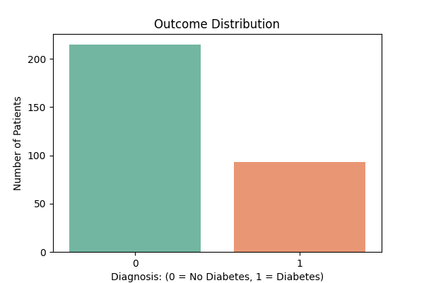
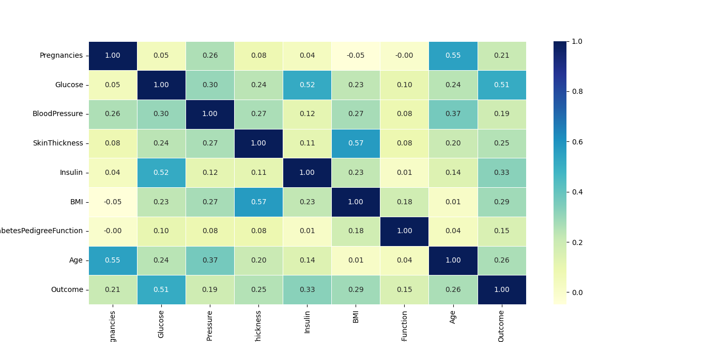
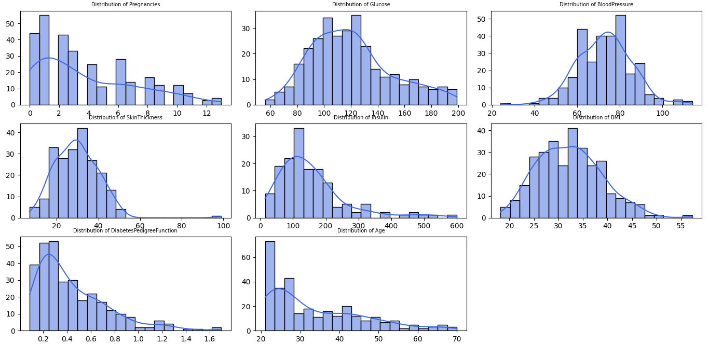
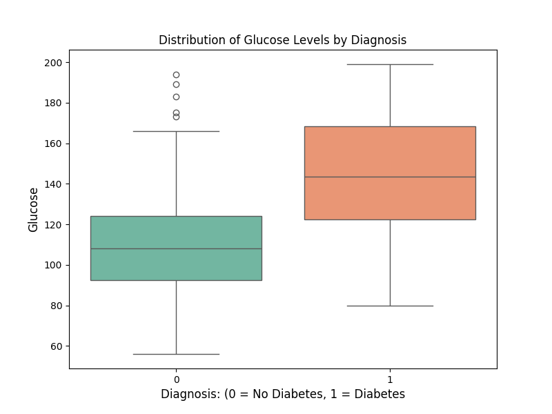
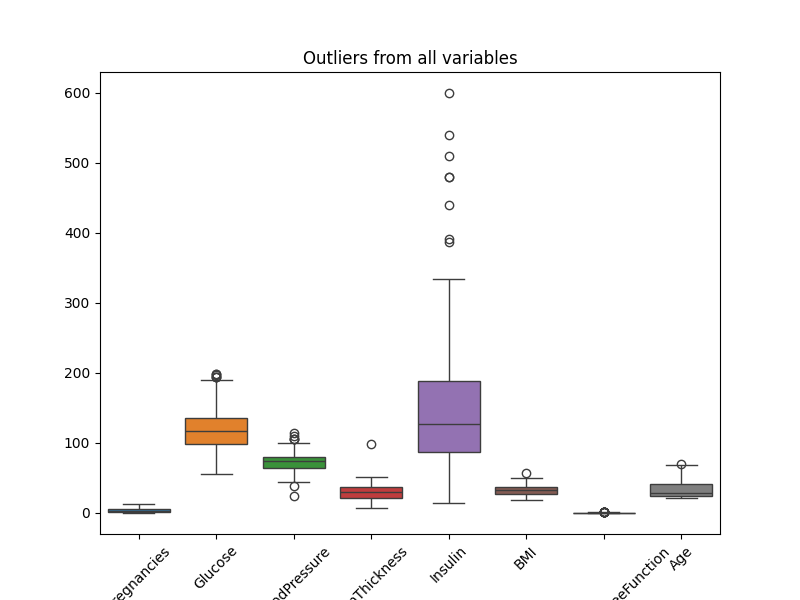
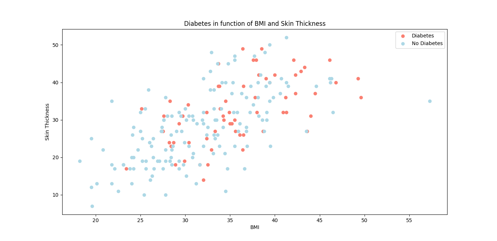
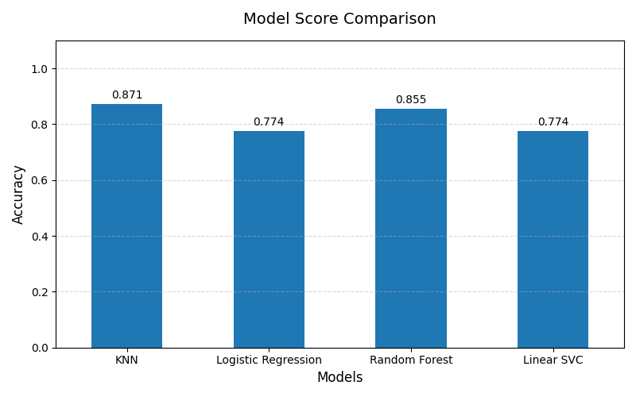
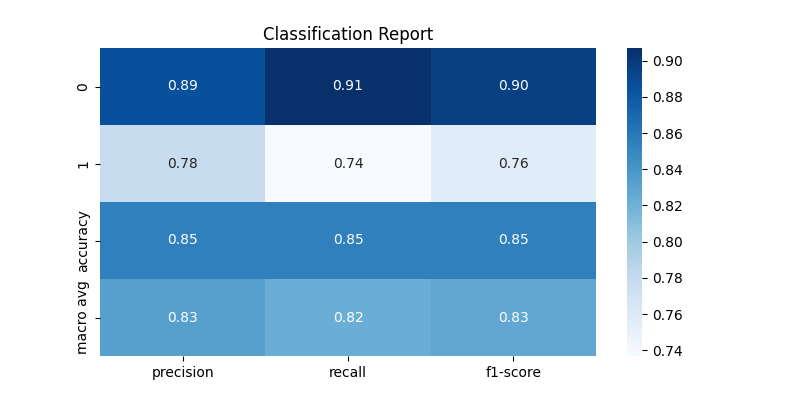
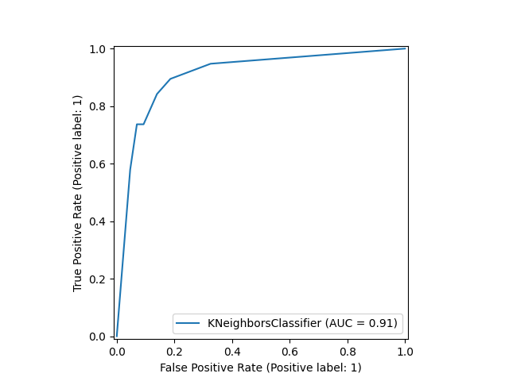

# Diabetes Prediction using Machine Learning

Predicting diabetes using supervised machine learning algorithms with a complete end-to-end workflow including exploratory data analysis, preprocessing, model comparison, hyperparameter tuning, and evaluation.

## Table of Contents

- [Dataset](#dataset)
- [Exploratory Data Analysis (EDA)](#exploratory-data-analysis-eda)
- [Data Cleaning and Preprocessing](#data-cleaning-and-preprocessing)
- [Model Training and Evaluation](#model-training-and-evaluation)
- [Results](#results)
- [Installation](#installation)
- [Usage](#usage)
- [Project Structure](#project-structure)
- [Future Improvements](#future-improvements)
- [License](#license)

## Dataset

This project uses the Diabetes Dataset published on Kaggle by Ehab Aboelnaga. The dataset contains 308 patient records, each described by demographic attributes, medical history, and clinical measurements.

The dataset includes measurements commonly used in diabetes prediction, such as glucose concentration, blood pressure, insulin level, body mass index (BMI), age, skin thickness, number of pregnancies, and the Diabetes Pedigree Function.

During exploratory data analysis, several biologically impossible values (e.g., glucose, BMI, blood pressure, skin thickness, and insulin equal to zero) were identified. These values were treated as missing observations (NaN) and later imputed using the median of the training set before model training.

## Exploratory Data Analysis (EDA)

Before building any machine learning model, an exploratory data analysis (EDA) was performed to better understand the dataset, identify relationships between variables, detect missing values and outliers, and evaluate data quality.

### Target Variable Distribution



The target variable represents whether a patient has diabetes (1) or not (0). The dataset shows a moderate class imbalance, with more non-diabetic than diabetic patients.

### Correlation Analysis



A correlation matrix was used to examine relationships between variables. Glucose exhibited the strongest positive correlation with the target variable, suggesting it is one of the most informative predictors.

### Distribution of Features



Histograms were used to inspect the distribution of each feature. Several variables showed skewed distributions, particularly Insulin and Skin Thickness.

### Glucose Distribution by Diagnosis



Patients diagnosed with diabetes generally present higher glucose levels compared to non-diabetic patients.

### Outliers Detection



Boxplots revealed the presence of potential outliers in multiple variables. These observations were investigated before preprocessing to determine whether they represented measurement errors or valid extreme values.

### BMI vs Skin Thickness



A scatter plot was generated to explore the relationship between BMI and Skin Thickness across both diagnostic groups. This visualization helps identify potential clustering patterns and relationships between body composition variables.

## Data Cleaning and Preprocessing

Before training the machine learning models, the dataset was cleaned and prepared to ensure data quality and improve model performance.

### Data Cleaning

The dataset was first inspected to understand its structure, identify missing values, and detect possible inconsistencies. The following steps were performed:

- Checked the dataset dimensions and data types of each feature.
- Verified the presence of missing values and duplicated records.
- Reviewed the statistical distribution of numerical variables to identify potential anomalies and outliers.
- Confirmed that all variables were correctly formatted for further analysis.

### Data Preprocessing

After cleaning the dataset, preprocessing techniques were applied to prepare the data for machine learning algorithms:

- Separated the target variable (Diagnosis) from the feature variables.
- Split the dataset into training and testing sets to evaluate model performance on unseen data.
- Applied feature scaling when required, since some algorithms are sensitive to differences in feature ranges.
- Prepared the processed data to be compatible with multiple supervised learning algorithms.

These preprocessing steps ensured that the models were trained using consistent, reliable, and appropriately formatted data.

## Model Training and Evaluation

After completing the data preprocessing stage, several supervised machine learning algorithms were trained and evaluated to identify the best-performing model for diabetes prediction.

### Model Training

The dataset was divided into training and testing sets to evaluate how well each model generalized to unseen data. The following classification algorithms were implemented and compared:

- Logistic Regression
- K-Nearest Neighbors (KNN)
- Random Forest Classifier
- Support Vector Machine (SVM)

Each model was trained using the training dataset and evaluated using the test dataset.

### Model Evaluation



To measure model performance, different evaluation metrics were analyzed:

- **Accuracy**: Measures the percentage of correctly classified samples.
- **Precision**: Evaluates how many predicted positive cases were actually positive.
- **Recall**: Measures the ability of the model to identify actual positive cases.
- **F1-score**: Provides a balance between precision and recall.

Additionally, confusion matrices and ROC curves were used to better understand model performance and classification behavior.

### Hyperparameter Tuning

After comparing the initial models, hyperparameter optimization was performed using `GridSearchCV` to improve the performance of the best-performing algorithms.

This process tested different combinations of parameters and selected the configuration that achieved the best validation results.

### Final Model Selection

The final model was selected based on its overall performance across evaluation metrics, prioritizing not only accuracy but also the ability to correctly identify diabetic patients.

The selected model represents the best balance between predictive performance and generalization capability.



The confusion matrix shows the number of correctly and incorrectly classified diabetic and non-diabetic patients, providing insight into false positives and false negatives.



The ROC Curve illustrates the trade-off between the True Positive Rate and False Positive Rate across different classification thresholds, allowing for a more detailed assessment of model performance.

## Results

<!-- TODO: fill in the actual numbers from your final model, e.g.:
| Metric    | Score |
|-----------|-------|
| Accuracy  | 0.85  |
| Precision | 0.78  |
| Recall    | 0.74  |
| F1-score  | 0.76  |
-->

Among the evaluated algorithms, the final selected model achieved the best overall predictive performance on the testing dataset after hyperparameter tuning.

The evaluation demonstrated that the model was capable of accurately distinguishing between diabetic and non-diabetic patients while maintaining a balanced performance across multiple evaluation metrics.

The comparison of different machine learning algorithms also highlighted how model selection and hyperparameter optimization can significantly influence predictive performance.

### Conclusion

This project demonstrates a complete end-to-end machine learning workflow for diabetes prediction, including data cleaning, exploratory data analysis, preprocessing, model comparison, hyperparameter tuning, and performance evaluation.

The results show that machine learning algorithms can effectively identify patterns associated with diabetes diagnosis when trained on relevant clinical features. Additionally, comparing multiple models and optimizing their hyperparameters improved the overall predictive performance.

Although the dataset is relatively small and may not fully represent real-world clinical populations, this project provides a solid foundation for developing predictive healthcare applications using machine learning.

## Installation

<!-- TODO: adjust to match your actual dependencies -->

1. Clone the repository:
   ```bash
   git clone https://github.com/<your-username>/<your-repo>.git
   cd <your-repo>
   ```

2. Create and activate a virtual environment (optional but recommended):
   ```bash
   python -m venv venv
   source venv/bin/activate  # On Windows: venv\Scripts\activate
   ```

3. Install the required dependencies:
   ```bash
   pip install -r requirements.txt
   ```

## Usage

<!-- TODO: adjust to match how your notebook/scripts are actually run -->

1. Open the Jupyter notebook:
   ```bash
   jupyter notebook diabetes_prediction.ipynb
   ```
2. Run the cells in order to reproduce the EDA, preprocessing, model training, and evaluation steps.

## Project Structure

<!-- TODO: adjust to match your actual repo layout -->

```
.
├── data/                   # Raw and processed dataset files
├── images/                 # Plots and figures used in this README
├── diabetes_prediction.py               # Main machine learning script
├── requirements.txt         # Python dependencies
└── README.md
```

## Future Improvements

Possible future improvements include:

- Collecting a larger and more diverse dataset.
- Experimenting with additional machine learning algorithms such as XGBoost or LightGBM.
- Performing more advanced feature engineering and feature selection.
- Deploying the trained model as an interactive web application using Streamlit or Flask.
- Evaluating the model on external datasets to assess its generalization performance.
- Incorporating explainability techniques such as SHAP or LIME to better understand model predictions.
- Developing a real-time prediction interface for healthcare applications.

## License

<!-- TODO: choose a license, e.g. MIT, and add a LICENSE file -->

This project is licensed under the MIT License. See the [LICENSE](LICENSE) file for details.
