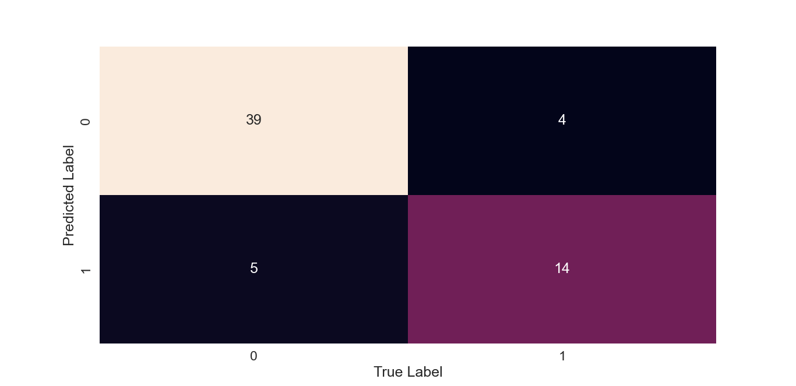

# Diabetes Prediction using Machine Learning

Predicting diabetes using supervised machine learning algorithms with a complete end-to-end workflow including exploratory data analysis, data cleaning, preprocessing, model comparison, hyperparameter tuning, and evaluation.

## Table of Contents

* [Dataset](#dataset)
* [Exploratory Data Analysis (EDA)](#exploratory-data-analysis-eda)
* [Data Cleaning and Preprocessing](#data-cleaning-and-preprocessing)
* [Model Training and Evaluation](#model-training-and-evaluation)
* [Results](#results)
* [Installation](#installation)
* [Usage](#usage)
* [Project Structure](#project-structure)
* [Future Improvements](#future-improvements)
* [License](#license)

## Dataset

This project uses the Diabetes Dataset published on Kaggle by Ehab Aboelnaga. The dataset contains **308 patient records**, each described by demographic attributes, medical history, and clinical measurements.

The dataset includes measurements commonly used in diabetes prediction, such as:

* Glucose concentration
* Blood pressure
* Insulin level
* Body mass index (BMI)
* Age
* Skin thickness
* Number of pregnancies
* Diabetes Pedigree Function

### Target Variable

The target variable is **Outcome**:

* `0` = No diabetes
* `1` = Diabetes

During exploratory data analysis, several biologically impossible values were identified. In particular, zero values in features such as Glucose, Blood Pressure, Skin Thickness, Insulin, and BMI were treated as missing observations (`NaN`) and handled during preprocessing.

## Exploratory Data Analysis (EDA)

Before building the machine learning models, an exploratory data analysis (EDA) was performed to better understand the dataset, identify relationships between variables, detect potential outliers, and evaluate data quality.

### Target Variable Distribution


The target variable represents whether a patient has diabetes (`1`) or not (`0`). The dataset contains more non-diabetic than diabetic patients, resulting in a moderate class imbalance.

### Correlation Analysis


A correlation matrix was used to examine relationships between variables. Glucose exhibited the strongest positive correlation with the target variable, suggesting that it is one of the most informative predictors of diabetes.

### Distribution of Features


Histograms were used to inspect the distribution of the numerical features. Several variables showed skewed distributions, particularly Insulin and Skin Thickness.

### Glucose Distribution by Diagnosis


Patients diagnosed with diabetes generally presented higher glucose levels compared to non-diabetic patients.

### Outliers Detection


Boxplots were used to identify potential outliers in multiple variables. These observations were examined during the data cleaning process to determine whether they represented measurement errors or valid extreme values.

### BMI vs Skin Thickness


A scatter plot was generated to explore the relationship between BMI and Skin Thickness across both diagnostic groups.

## Data Cleaning and Preprocessing

Before training the machine learning models, the dataset was cleaned and prepared to ensure data quality and improve model performance.

### Data Cleaning

The following steps were performed:

* Inspected the dataset dimensions and data types.
* Checked for missing values and duplicated records.
* Reviewed descriptive statistics to identify potential anomalies.
* Identified biologically impossible zero values in relevant clinical features.
* Replaced invalid measurements with `NaN`.

### Data Preprocessing

The following preprocessing steps were applied:

* Separated the target variable (`Outcome`) from the feature variables.
* Split the dataset into training and testing sets.
* Imputed missing values using the median calculated from the training data.
* Applied feature scaling where required by the algorithms.
* Prepared the processed data for machine learning model training and evaluation.

These preprocessing steps helped ensure that the models were trained using consistent and appropriately formatted data.

## Model Training and Evaluation

After completing the data cleaning and preprocessing stages, several supervised machine learning algorithms were trained and compared to identify the strongest model for diabetes prediction.

### Models

The following classification algorithms were implemented:

* Logistic Regression
* K-Nearest Neighbors (KNN)
* Random Forest Classifier
* Linear Support Vector Classifier (Linear SVC)

Each model was trained using the training dataset and evaluated on the testing dataset.

### Evaluation Metrics

The following metrics were used to evaluate model performance:

* **Accuracy:** Measures the percentage of correctly classified samples.
* **Precision:** Measures how many predicted positive cases were actually positive.
* **Recall:** Measures how many actual positive cases were correctly identified.
* **F1-score:** Provides a balance between precision and recall.
* **Cross-validation:** Used to evaluate model performance across different subsets of the training data.

### Model Comparison


The performance of the different classification algorithms was compared to identify the strongest candidate for the final model.

### Hyperparameter Tuning

Hyperparameter optimization was performed using `GridSearchCV` to test different parameter combinations and identify configurations that could improve model performance.

The best-performing configuration was then used to evaluate the final model on the testing dataset.

### Classification Report


The classification report provides a detailed evaluation of the final model for both classes.

The model achieved an overall **accuracy of 0.85** on the testing dataset.

For **Class 0 (non-diabetic patients)**:

* Precision: **0.89**
* Recall: **0.91**
* F1-score: **0.90**
* Support: **43**

For **Class 1 (diabetic patients)**:

* Precision: **0.78**
* Recall: **0.74**
* F1-score: **0.76**
* Support: **19**

The **macro-average F1-score was 0.83**, while the **weighted-average F1-score was 0.85**.

The model performed better at identifying non-diabetic patients than diabetic patients. The recall of **0.74 for Class 1** indicates that the model correctly identified approximately 74% of the patients who actually had diabetes.

### Confusion Matrix



The confusion matrix shows the number of correctly and incorrectly classified diabetic and non-diabetic patients, providing insight into false positives and false negatives.

### ROC Curve


The ROC curve illustrates the trade-off between the True Positive Rate and False Positive Rate across different classification thresholds, providing an additional assessment of model performance.

## Results

The final model achieved the following performance on the testing dataset:

| Metric    | Score |
| --------- | ----: |
| Accuracy  |  0.85 |
| Precision |  0.78 |
| Recall    |  0.74 |
| F1-score  |  0.76 |

The results indicate that the model was able to distinguish between diabetic and non-diabetic patients with an overall accuracy of **85%**.

The model achieved stronger performance for non-diabetic patients, while the recall for diabetic patients was lower. This is an important consideration in a diabetes prediction task because failing to identify a patient who actually has diabetes represents a false negative.

The results demonstrate the importance of evaluating classification models using multiple metrics rather than relying on accuracy alone.

### Conclusion

This project demonstrates a complete end-to-end machine learning workflow for diabetes prediction, including data cleaning, exploratory data analysis, preprocessing, model comparison, hyperparameter tuning, and performance evaluation.

The results show that supervised machine learning algorithms can identify patterns associated with diabetes diagnosis using clinical and demographic features.

Although the dataset is relatively small and may not fully represent real-world clinical populations, the project provides a practical example of applying machine learning techniques to a healthcare-related classification problem.

## Installation

### 1. Clone the repository

```bash
git clone https://github.com/juli1511/diabetes-prediction-ml.git
cd diabetes-prediction-ml
```

### 2. Create and activate a virtual environment

Creating a virtual environment is optional but recommended.

```bash
python -m venv venv
```

On Windows:

```bash
venv\Scripts\activate
```

### 3. Install the dependencies

```bash
pip install -r requirements.txt
```

## Usage

The project was developed using **Python in Visual Studio Code**.

To reproduce the project:

1. Clone the repository.
2. Create and activate a virtual environment.
3. Install the required dependencies using `requirements.txt`.
4. Open the Python script containing the machine learning workflow.
5. Run the script to reproduce the data cleaning, exploratory data analysis, preprocessing, model training, and evaluation steps.

## Project Structure

```text
.
├── data/                   # Raw and processed dataset files
├── images/                 # Plots and figures used in this README
├── diabetes_prediction.py  # Main machine learning script
├── requirements.txt        # Python dependencies
├── README.md               # Project documentation
└── LICENSE                 # MIT License
```

## Future Improvements

Possible future improvements include:

* Collecting a larger and more diverse dataset.
* Experimenting with additional machine learning algorithms.
* Performing more advanced feature engineering and feature selection.
* Performing more extensive hyperparameter optimization.
* Evaluating the model on external datasets to assess its generalization performance.
* Incorporating explainability techniques such as SHAP or LIME to better understand model predictions.
* Deploying the trained model as an interactive web application.
* Developing a real-time prediction interface for educational or research purposes.

## License

This project is licensed under the MIT License. See the [LICENSE](LICENSE) file for details.
